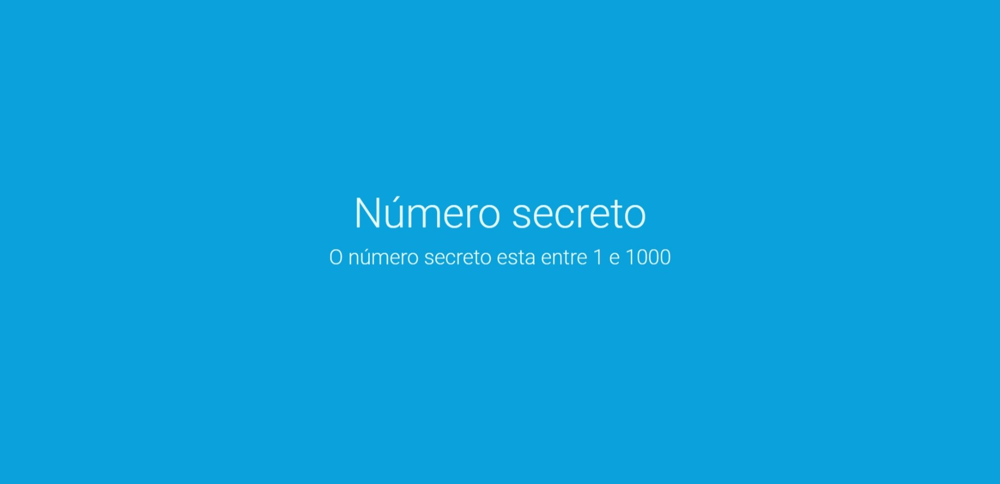

# Jogo Número Secreto

> Jogo número secreto

Projeto desenvolvido no curso da Alura com finalidade de desenvolver habilidades em javascript

Descrição: O site define um número aleatório e o usuário deve tentar acerta-lo apenas com o comando de voz

[Clique aqui para acessar](https://vinidevit.github.io/numero-secreto/)

#  Tecnologias

>HTML

>CSS

>Javascript

>Figma

>Git e Github
